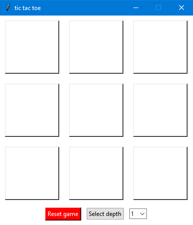

# TIC TAC TOE GAME

### single player tic tac toe game played against AI
- AI in this game uses the `minimax algorithm` and a specific `heuristic function` according to which it decides how to play against you
- you can change the depth of the algorithm - meaning how many moves ahead the AI takes into account (from 1 up to 8 moves ahead)
- after the game is done, a pop-up window declaring the winner is shown
- you can reset the game at any time and start over

## LIVE DEMO

